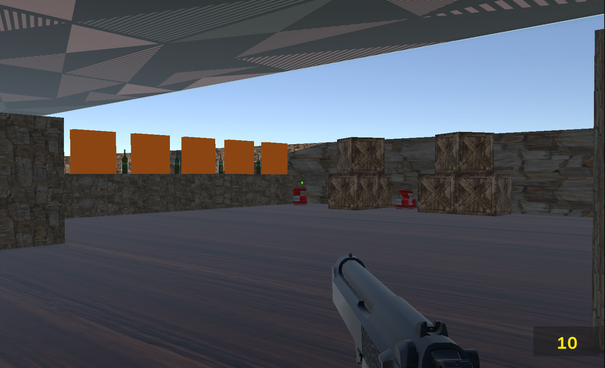

# Unity FPS Prototype

A simple first-person shooter prototype built with Unity.

## Features
- WASD player movement
- Mouse look camera
- Sprint system
- Handgun shooting
- Projectile bullets
- Bullet impact effects (smoke)
- Bottle targets
- Ammo pickup system
- Dynamic crosshair
- Footstep audio

## Tech
- Unity
- C#
- Unity New Input System

## Architecture
InputReader → Player systems  
- PlayerMovement  
- PlayerLook  
- WeaponController  

## Status
Core FPS mechanics implemented.

